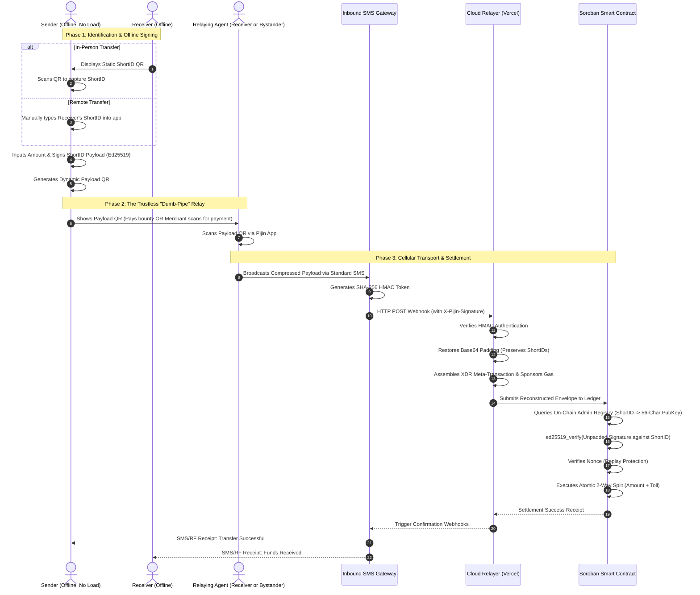

 

  

  
   
  <h3>&nbsp;&nbsp;Pijin</h3>
  
&nbsp;&nbsp;<b><i>Bringing digital money within reach, even offline.</i></b>

 
 

  
  

## 🧩 Problem

Many people in rural areas, remote communities, and provincial towns have limited, unreliable, or zero access to 4G/WiFi. Because of this, they are often excluded from using e-wallets and digital transactions that require a constant broadband internet connection. This affects small merchants, everyday users wanting to send money to family, transportation operators, and anyone who wants to participate in digital payments but cannot rely on online systems.

Our problem is: **How can people continue to access secure, real-time digital peer-to-peer (P2P) payments in zero-data areas without requiring users to buy expensive hardware or assume the risk of delayed settlement?**

## 💡 Solution

Pijin is a Web2.5 data-free unified payment system that bridges cutting-edge blockchain cryptography with ubiquitous cellular infrastructure (GSM/SMS). The system enables seamless peer-to-peer (P2P) transfers regardless of geographic distance or internet availability.

Users fund their wallets online via regulated Stellar Anchors (SEP-24) and secure those funds in an on-chain escrow vault.  To ensure a frictionless user experience, the system relies on an offline-first architecture using a high-performance local database (Drizzle ORM) on the phone. This guarantees immediate UI updates locally while the heavy lifting of blockchain communication is offloaded to the cellular network.

When transitioning to zero-data environments, Pijin utilizes dynamic transport routing based on the user's cellular load. To initiate a transfer, the sender captures the receiver's ID (either by scanning their static QR code in person or typing it manually) and the app securely signs the transaction offline. If the sender has cellular load, the app compresses this payload and transmits it silently via direct SMS. If the sender has zero load, the app generates a dynamic Payload QR code, allowing an authorized bystander to scan and relay the SMS on their behalf. This SMS is received by our Zero-API Gateway and forwarded to a cloud relayer, which submits the data to a Soroban smart contract. The contract mathematically verifies the offline signature, prevents double-spending, and settles the transaction in real-time.

## 🌟 Vision

Pijin aims to make digital transactions more inclusive by providing universal Web3 liquidity powered by cellular networks. We want e-transactions to be available not only to people in cities with stable internet, but also to people in rural and underserved areas relying on basic cell towers. A future where digital payments are within reach for everyone, regardless of internet reliability.

## 🎯 Purpose

The fundamental purpose of Pijin is to decouple decentralized finance from broadband internet dependency. We aim to empower unbanked, offline, and remote communities to participate in real-time digital economies without being forced to upgrade their hardware or rely on continuous cellular data. By transforming legacy telecommunication bands (like standard GSM/SMS and low-power RF) into trustless cryptographic transport layers, Pijin ensures that true financial inclusion—where users retain absolute sovereignty over their funds—can reach the most infrastructure-limited regions on the globe.

## 👥 Target Users

Pijin is designed as a universal digital cash app for communities and users who experience unreliable mobile data but have basic GSM cellular coverage.
 

Our target users include:
- Everyday users sending P2P remittances to family and friends.
- Small retail store owners and wet market vendors.
- Tricycle drivers and transport operators.
- Rural households and island communities.
- LGUs and NGOs that need data-free aid distribution systems.
 

The app uses familiar, **non-technical** labels:
- Online Balance
- Offline Cash Vault
- Send Money
- Receive Money

## ✨ Pijin Features
- **Non-Custodial Offline Cryptography:** Pijin generates local private keys on the device. Transactions are mathematically signed and sealed completely offline, guaranteeing that central servers act only as "dumb pipes" and cannot intercept or alter user funds.
- **Dynamic Zero-Data Routing:** Intelligent transport switching that instantly defaults to compressed SMS transmission (or low-power LoRaWAN modules) the moment the device loses internet connectivity.
- **Bystander "Dumb-Pipe" Relay (Payload QR):** A novel fallback mechanism allowing users with zero cellular load to generate a signed "Payload QR." Any bystander with a text promo can scan and broadcast the transaction on their behalf without compromising the sender's security.
- **Deterministic Mathematical Compression:** A proprietary local compression engine that maps massive Web3 variables into Base62 encodings and unpadded Base64 strings, shrinking 294-character ledger intents into 152-character payloads that fit perfectly inside a single SMS frame.
- **On-Chain State Resolution:** Eliminates the need for backend state synchronization. The Soroban smart contract independently resolves 6-character ShortIDs into 56-character public keys via an on-chain admin registry, solving the "cold start" problem for offline mobile nodes.
- **Seamless Fiat On-Ramp (SEP-24):** Direct integration with regulated Stellar Anchors allowing users to easily convert physical cash into highly liquid, fiat-backed stablecoins (e.g., PHPC) via interactive, KYC-compliant webviews.
- **Dual Wallet and Offline Vault Architecture:** Pijin separates online wallet funds from an offline spending vault. Users can move funds between both balances, with offline funds explicitly restricted to face-to-face payments.
- **Automatic Offline Payment Queue and Reconciliation:** Offline payments are stored locally in SQLite, queued while disconnected, and automatically submitted when connectivity returns. The app reconciles nonces against backend settlements, prevents duplicate settlement, and retries failures.
- **Local-First Transaction History:** Transaction history is persisted in SQLite and synchronized with backend records using upsert logic. The app supports separate Wallet, Offline Funds, and combined transaction views.
- **SEP-10 Authentication for SEP-24:** The anchor flow authenticates the user by fetching a challenge, signing it with the wallet key, and exchanging it for a short-lived authorization token before starting deposits or withdrawals.
- **SMS Transaction Receipts:** After successful offline settlement, the backend can send a receipt notification to the sender and receiver through the configured SMS gateway.

## 🏛️ Pijin Architecture

    

## 🌍 Stellar Ecosystem Proposal(SEP) Protocol Integration
- SEP-1 (Stellar Info File)
- SEP-10 (Stellar Web Authentication)
- SEP-24 (Hosted Deposit and Withdrawal)

## 📃 Smart Contract Functions - Pijin Smart Contract

- **Initialization & Upgrades**
  - `__constructor(env, admin, treasury)`: Protocol 22 initialization that sets the privileged Admin and Treasury addresses. Starts with the Admin as the default Registrar.
  - `upgrade(env, new_wasm_hash)`: Allows the Admin to upgrade the contract's WASM hash to a newer version.
    
- **User Vault Management**
  - `deposit(env, sender, token, pubkey, amount)`: Transfers ERC-20 equivalent tokens (Stellar assets or Soroban tokens) from the user's wallet to the contract, locking them in a multi-token vault and registering the user's Ed25519 offline signing key.
  - `withdraw(env, sender, token, amount)`: Unlocks tokens from the sender's vault, transferring them back to their Stellar wallet. Supports partial or full withdrawals (cleaning up storage rent for full withdrawals).
  - `get_vault(env, user, token)`: Read-only helper to check the vault balance for a specific user and token.

- **Offline Payment Engine (Data-Free Transport)**
  - `spend_offline(env, gateway, sender, token, receiver_short_id, amount, protocol_toll, nonce, signature)`: The core offline settlement engine. Executed by a whitelisted gateway relayer. Cryptographically verifies a payload signed by the sender’s `offline_key`, prevents replay attacks via persistent nonces, dynamically resolves the receiver's `short_id`, and executes the vault-to-vault transfer alongside the protocol toll routing.
  - `set_offline_key(env, sender, pubkey)`: Allows vault owners to rotate their registered offline signing device without depositing tokens.
  - `get_offline_key(env, sender)`: Read-only check for clients to verify a device is still the active registered signer before generating vouchers.

- **Recipient Identity Registry (Short-ID Mapping)**
  - `set_registrar(env, admin, registrar)`: Admin control to assign a narrowly-scoped backend signer responsible for managing short-ID mappings.
  - `register_recipient(env, registrar, short_id, receiver)`: Registrar-only function to map a canonical 6-byte Base62 `short_id` to a Stellar address (wallet). Idempotent on identical mappings.
  - `update_recipient(env, registrar, short_id, receiver)`: Registrar-only function to explicitly rotate an existing `short_id` mapping to a new wallet address.
  - `get_recipient(env, short_id)`: Read-only lookup to resolve a short ID to its canonical Stellar address.

- **Gateway Access Control**
  - `register_gateway(env, admin, gateway)`: Whitelists a new relayer address permitted to submit `spend_offline` transactions.
  - `remove_gateway(env, admin, gateway)`: Revokes a gateway's submission permissions.

## 🛠️ Tech Stack

- **Frontend (Mobile App)**
  - **Framework:** React Native (Expo)
  - **Local Database:** SQLite with Drizzle ORM
  - **Key Features:** Offline QR Generation & Compression, Offline Ed25519 Key Management

- **Backend (API)**
  - **Framework:** Next.js (API Routes)
  - **Database & ORM:** PostgreSQL (Neon Serverless) and Prisma ORM
  - **Key Features:** Interactive SEP-24 Webviews, Transaction Simulation, API Documentation (Swagger)

- **Infrastructure & Smart Contracts**
  - **Blockchain:** Stellar / Soroban Smart Contracts (Rust)
  - **Message Queues:** Upstash QStash (Serverless Background Jobs & Webhook Deliveries)
  
- **Other Tools & Integrations**
  - **SMS Gateway:** Textbee (Zero-API SMS Gateway for offline payloads)
  - **Cryptography:** Node.js Crypto / `@stellar/stellar-sdk` (Ed25519 Signature Verification & XDR encoding)
  - **Wallet Integration:** Stellar Demo Wallet (for SEP-24 Auth & Testing)

### 📚 API Documentation

The Pijin backend is powered by Next.js API Routes and serves as the bridge between the mobile app, the Soroban smart contracts, and the Stellar ecosystem. 
 

For detailed request/response schemas, testing, and OpenAPI specifications,   visit our interactive Swagger documentation:
👉 **[View Interactive API Docs](https://pijin-api.vercel.app/api-docs)**

### Core Services

**Authentication & Onboarding (SEP-10 & OTP)**
- `POST /api/auth` — Initiates and verifies the SEP-10 Stellar Web Authentication flow to issue a session JWT.
- `POST /api/otp/send` — Triggers a 6-digit OTP SMS via the gateway for phone verification.
- `POST /api/otp/verify` — Validates the OTP during user registration.
- `POST /api/register` — Registers a new user's device and maps their short ID.

**Offline Settlement Engine**
- `POST /api/engine/settle` — The core relayer endpoint. Receives compressed, offline-signed payloads (via SMS webhooks or direct sync), unpacks the XDR, and submits the `spend_offline` Soroban transaction to the network.
- `POST /api/sms` — Ingress webhook for the Textbee zero-API SMS gateway.

**Wallet & History**
- `GET /api/wallet/history` — Aggregates unified transaction history (merging Soroban settlements and SEP-24 anchor transactions).
- `GET /api/wallet/balance` — Fetches the user's current on-chain vault balances.

**Fiat On/Off Ramps (SEP-24 Anchor)**
- `GET /api/sep24/info` — Advertises supported deposit/withdrawal assets and fees (SEP-24 capabilities).
- `POST /api/sep24/transactions/deposit/interactive` — Initiates a fiat deposit and returns the interactive webview URL.
- `POST /api/sep24/transactions/withdraw/interactive` — Initiates a fiat withdrawal and returns the interactive webview URL.
- `GET /api/sep24/transaction` — Polls the real-time status of an ongoing fiat transaction.

## Pijin Treasury Portal

## 🌐 Deployment

### Testnet
- **Smart Contract Address:** `CCGXMMXAYI4EHTGSH65ML3VK6TTRBQGT3BT2NN3P6Y3LGN6XIL2HILPX`
- **Minted PHPC Token Address:** `CD26OANM4I4GF2GBC47UYTSP3FUBZRQ7WGMGECEQHMZ2D6QV2LXJTNIS`
- **PHPC Issuer Public Key:** `GDDKZAOAME26SD2GAQGGDUTI6F5VQ5CLXXELWOYOAXLUIQTQVLIFWZLY`
- **Admin Public Key:** `GAZDBPU7QQWHOZ53MFQO5I2O6OSAQSEOE3OMXDZNBXJCRV2RPVTGDYKS`
- **Treasury Public Key:** `GBV6SIDIZVHR22Y4KH4MTTYQOGSKNHZ27IWGSHVIHMK2HUUERVVMKFAM`
- **Registrar Public Key:** `GAFVQPZFHN5GUCTXZQXC6RKI4U4R47VNANCDSZ7KES4KQ7MEWJKUZOKH`
- **Gateway / Relayer:** `GDTDK62M4ZJU6QPCEFUSQWOPYED4I4GPHLB4ZZTMBZZL2AO2VK63VQUH`
- 📸 **Screenshot — Stellar Expert (Testnet)**

## 🎥 Demo
- 📱 **Live Mobile App:** [Link to Vercel/APK]
- 🔗 **Backend Api:** [Pijin API](https://pijin-api.vercel.app)
- 🔗 **Treasury Portal:** 
- 🎬 **Demo Video:** [Google Drive link](Link)
- 🖼️ **Pitch Deck:** [Canva link](Link)

  
## 👨‍💻 Team

  
| Name | Role | GitHub |
|---|---|---|
|Mark Kengie Aldabon| Frontend Developer / DevOps | [@Mark](https://github.com/tambayNgOrtigasAvenue ) |
| Carl Arbolado | Backend Developer / Frontend Developer / Team Lead | [@Carl](https://github.com/Kaido147) |
| Erickson Guhilde | Backend Developer / Quality Assurance | [@Erickson](https://github.com/riXoon) |
| Cedric Paul Mendoza | System Architect / System Analyst | [@Cedric](https://github.com/daeroSys) |
| Janrell Quiaroro | Backend Developer / Quality Assurance / Web3 Architect | [@Janrell](https://github.com/0xreru) |

## 📜 License
MIT
